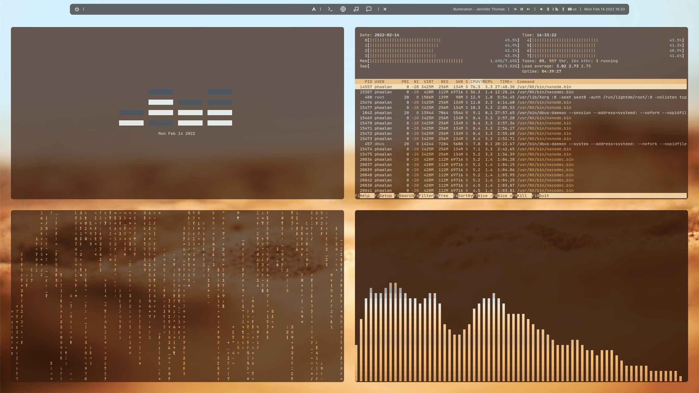

Personal dotfiles for AwesomeWM configuration

The evolution of Arch noob's atttemp to rice

Screenshot:

Credits:
- MateoNitro550/xxxwindowPolybarModule  
https://github.com/MateoNitro550/xxxwindowPolybarModule.git  
(Polybar custom module w shell script replacing xwindow module)  
Modified to polyxwin.sh  

- PrayagS/polybar-spotify  
https://github.com/PrayagS/polybar-spotify.git  
(Polybar custom module w shell script displays scrolling current song info)  
Modified to get_status.sh & scroll_status.sh  
Enhanced get_status.sh to paly_pause.sh for Polybar play-pause icon button toggle  

- petra-fied/viscolourchanger  
https://git.bune.city/petra-fied/viscolourchanger.git  
(Custom shell script to import Pywal generated colourschemes into Vis)  
Modified viscolourchanger to wallcolour.sh  
Added random directory selection & random wallpaper file selection  

- egeesin/alacritty-color-export  
https://github.com/egeesin/alacritty-color-export.git  
(Custom shell sript to import Pywal generated colour schemes into Alacritty)  
Renamed to alacolour.sh
